# ER_DIAGRAM_V1.1_DRAFT.md

Project: Conversational Commerce Platform
Version: ER Diagram v1.1 Draft
Status: PROPOSED
Purpose: Consolidated data model after Business Rule Review BR-001 → BR-100

---

# 1. Design Principles

1. Multi-tenant by default
2. `organization_id` on business-owned tables
3. UUID as internal PK
4. human-readable business numbers separated from UUID
5. append-only ledgers for stock, credit, loyalty
6. snapshots for historical commercial records
7. provider-specific data isolated behind integration layer
8. Order, Payment, Fulfillment statuses separated
9. Product master is current state; Order Item is historical state
10. promotion definitions separated from applied promotion snapshots
11. paid-held orders retain allocation
12. purchase session orchestrates multiple orders but never replaces them
13. audit and event traceability are first-class

---

# 2. Domain Overview

```text
ORGANIZATION
   |
   +-- USERS / ROLES / PERMISSIONS
   |
   +-- CUSTOMERS
   |     |
   |     +-- IDENTITIES
   |     +-- ADDRESSES
   |     +-- TAGS
   |     +-- CREDIT
   |     +-- LOYALTY
   |     +-- TIERS
   |
   +-- CHANNELS / CONVERSATIONS
   |     |
   |     +-- MESSAGES
   |     +-- LIVE SESSIONS
   |
   +-- PRODUCTS
   |     |
   |     +-- VARIANTS
   |     +-- CATEGORIES
   |     +-- TAGS
   |     +-- PROMOTION CLASSES
   |
   +-- INVENTORY
   |     |
   |     +-- MOVEMENTS
   |     +-- RESERVATIONS
   |     +-- ALLOCATIONS
   |
   +-- CARTS
   |     |
   |     +-- CART ITEMS
   |
   +-- PURCHASE SESSIONS
   |     |
   |     +-- SESSION ORDERS
   |
   +-- ORDERS
   |     |
   |     +-- ITEMS
   |     +-- ADDRESSES
   |     +-- DISCOUNTS / BENEFITS
   |     +-- ADJUSTMENTS
   |     +-- HOLDS
   |
   +-- PAYMENTS
   |     |
   |     +-- TRANSACTIONS
   |     +-- REFUNDS
   |     +-- COD SETTLEMENTS
   |
   +-- PROMOTIONS
   |
   +-- FULFILLMENT
   |     |
   |     +-- FULFILLMENTS
   |     +-- SHIPMENTS
   |     +-- RETURNS / RTO
   |
   +-- NOTIFICATIONS / TASKS
   |
   +-- INTEGRATION EVENTS
   |
   +-- AUDIT LOGS
```

---

# 3. Mermaid ER Diagram — Core

```mermaid
erDiagram

    ORGANIZATIONS ||--o{ PROFILES : has
    ORGANIZATIONS ||--o{ CUSTOMERS : owns
    ORGANIZATIONS ||--o{ PRODUCTS : owns
    ORGANIZATIONS ||--o{ WAREHOUSES : owns
    ORGANIZATIONS ||--o{ ORDERS : owns
    ORGANIZATIONS ||--o{ PROMOTION_CAMPAIGNS : owns

    CUSTOMERS ||--o{ CUSTOMER_IDENTITIES : has
    CUSTOMERS ||--o{ CUSTOMER_ADDRESSES : has
    CUSTOMERS ||--o{ CUSTOMER_TAG_LINKS : tagged
    CUSTOMER_TAGS ||--o{ CUSTOMER_TAG_LINKS : links

    CHANNEL_ACCOUNTS ||--o{ CONVERSATIONS : contains
    CUSTOMERS ||--o{ CONVERSATIONS : participates
    CONVERSATIONS ||--o{ MESSAGES : contains
    CONVERSATIONS ||--o{ CONVERSATION_ORDERS : links
    ORDERS ||--o{ CONVERSATION_ORDERS : links

    PRODUCTS ||--o{ PRODUCT_VARIANTS : has
    CATEGORIES ||--o{ PRODUCTS : categorizes
    PRODUCT_VARIANTS ||--o{ PRODUCT_VARIANT_TAG_LINKS : tagged
    PRODUCT_TAGS ||--o{ PRODUCT_VARIANT_TAG_LINKS : links

    PRODUCT_VARIANTS ||--o{ PRODUCT_VARIANT_PROMOTION_CLASSES : maps
    PRODUCT_PROMOTION_CLASSES ||--o{ PRODUCT_VARIANT_PROMOTION_CLASSES : classifies

    WAREHOUSES ||--o{ INVENTORY_BALANCES : stores
    PRODUCT_VARIANTS ||--o{ INVENTORY_BALANCES : stocked
    PRODUCT_VARIANTS ||--o{ INVENTORY_MOVEMENTS : moves
    PRODUCT_VARIANTS ||--o{ INVENTORY_RESERVATIONS : reserves
    PRODUCT_VARIANTS ||--o{ INVENTORY_ALLOCATIONS : allocates

    CUSTOMERS ||--o{ CARTS : owns
    CONVERSATIONS ||--o{ CARTS : creates
    LIVE_SESSIONS ||--o{ CARTS : sources
    CARTS ||--o{ CART_ITEMS : contains
    PRODUCT_VARIANTS ||--o{ CART_ITEMS : references

    CUSTOMERS ||--o{ PURCHASE_SESSIONS : owns
    PURCHASE_SESSIONS ||--o{ PURCHASE_SESSION_ORDERS : groups
    ORDERS ||--o{ PURCHASE_SESSION_ORDERS : belongs

    CUSTOMERS ||--o{ ORDERS : places
    ORDERS ||--o{ ORDER_ITEMS : contains
    ORDERS ||--o{ ORDER_ADDRESSES : snapshots
    ORDERS ||--o{ ORDER_STATUS_HISTORY : tracks
    ORDERS ||--o{ ORDER_ADJUSTMENTS : adjusts
    ORDERS ||--o{ ORDER_HOLDS : holds

    PRODUCT_VARIANTS ||--o{ ORDER_ITEMS : snapshots

    ORDERS ||--o{ PAYMENTS : has
    PAYMENTS ||--o{ PAYMENT_TRANSACTIONS : records
    PAYMENTS ||--o{ REFUNDS : refunds

    ORDERS ||--o{ FULFILLMENTS : fulfills
    FULFILLMENTS ||--o{ FULFILLMENT_ITEMS : contains
    FULFILLMENTS ||--o{ SHIPMENTS : ships
    SHIPMENTS ||--o{ TRACKING_EVENTS : tracks

    ORDERS ||--o{ RETURNS : returns
    RETURNS ||--o{ RETURN_ITEMS : contains

    CUSTOMERS ||--o{ CUSTOMER_CREDIT_ACCOUNTS : owns
    CUSTOMER_CREDIT_ACCOUNTS ||--o{ CUSTOMER_CREDIT_TRANSACTIONS : ledger
    CUSTOMER_CREDIT_ACCOUNTS ||--o{ CUSTOMER_CREDIT_LOTS : lots

    CUSTOMERS ||--o{ LOYALTY_ACCOUNTS : owns
    LOYALTY_PROGRAMS ||--o{ LOYALTY_ACCOUNTS : governs
    LOYALTY_ACCOUNTS ||--o{ LOYALTY_TRANSACTIONS : ledger
    CUSTOMERS ||--o{ CUSTOMER_TIER_HISTORY : history
    CUSTOMER_TIERS ||--o{ CUSTOMER_TIER_HISTORY : assigns

    PROMOTION_CAMPAIGNS ||--o{ PROMOTION_CONDITION_GROUPS : has
    PROMOTION_CONDITION_GROUPS ||--o{ PROMOTION_CONDITIONS : contains
    PROMOTION_CAMPAIGNS ||--o{ PROMOTION_RULES : has
    PROMOTION_RULES ||--o{ PROMOTION_ACTIONS : triggers
    PROMOTION_ACTIONS ||--o{ PROMOTION_PRICE_MAPPINGS : maps
    PROMOTION_ACTIONS ||--o{ PROMOTION_TIERS : tiers
    PROMOTION_ACTIONS ||--o{ PROMOTION_REWARD_RULES : rewards
    PROMOTION_CAMPAIGNS ||--o{ PROMOTION_BUNDLES : bundles
    PROMOTION_BUNDLES ||--o{ PROMOTION_BUNDLE_COMPONENTS : components
    PROMOTION_CAMPAIGNS ||--o{ PROMOTION_TRIGGER_CODES : triggers
    PROMOTION_TRIGGER_CODES ||--o{ PROMOTION_TRIGGER_REDEMPTIONS : redeemed

    ORDERS ||--o{ PROMOTION_APPLIED_BENEFITS : receives
    ORDER_ITEMS ||--o{ PROMOTION_APPLIED_BENEFITS : receives

    ORDERS ||--o{ ORDER_CONSOLIDATION_MEMBERS : grouped
    ORDER_CONSOLIDATIONS ||--o{ ORDER_CONSOLIDATION_MEMBERS : contains

    COD_SETTLEMENTS ||--o{ COD_SETTLEMENT_ITEMS : contains
    ORDERS ||--o{ COD_SETTLEMENT_ITEMS : settles

    ORGANIZATIONS ||--o{ NOTIFICATIONS : owns
    NOTIFICATIONS ||--o{ NOTIFICATION_RECIPIENTS : targets

    ORGANIZATIONS ||--o{ INTEGRATION_EVENTS : receives
    ORGANIZATIONS ||--o{ AUDIT_LOGS : audits
```



---

# 4. Organization & Security

## organizations
Core tenant.

Fields:
- id
- name
- slug
- status
- timezone
- currency
- created_at
- updated_at

## profiles
User profile mapped to auth user.

Fields:
- id
- organization_id
- auth_user_id
- display_name
- status
- created_at

## roles
- id
- organization_id
- code
- name

## permissions
- id
- code
- name

## role_permissions
- role_id
- permission_id

## profile_roles
- profile_id
- role_id

RLS boundary:
`organization_id = current organization`

---

# 5. Customer Domain

## customers
- id
- organization_id
- customer_code
- first_name
- last_name
- phone
- email
- status
- merged_into_customer_id
- created_at
- updated_at

## customer_identities
- id
- organization_id
- customer_id
- provider
- external_user_id
- display_name
- verification_status
- created_at

## customer_addresses
- id
- organization_id
- customer_id
- label
- recipient_name
- phone
- address_line1
- address_line2
- subdistrict
- district
- province
- postal_code
- country_code
- is_default
- status

## customer_tags
- id
- organization_id
- code
- name

## customer_tag_links
- customer_id
- tag_id
- created_at

## customer_merge_history
- id
- organization_id
- source_customer_id
- target_customer_id
- merged_by
- reason
- created_at

---

# 6. Conversation & Live Commerce

## channel_accounts
- id
- organization_id
- provider
- external_account_id
- display_name
- status
- capabilities_json

## conversations
- id
- organization_id
- channel_account_id
- customer_id
- external_conversation_id
- status
- assigned_profile_id
- last_message_at
- created_at
- updated_at

## messages
- id
- organization_id
- conversation_id
- external_message_id
- direction
- sender_type
- message_type
- content_text
- raw_event_id
- sent_at
- received_at
- unsent_at
- deleted_at

## conversation_assignments
- id
- conversation_id
- assigned_profile_id
- assigned_team_id nullable
- assigned_at
- unassigned_at

## conversation_notes
- id
- conversation_id
- profile_id
- note
- created_at

## conversation_orders
- conversation_id
- order_id
- created_at

## live_sessions
- id
- organization_id
- channel_account_id
- external_live_id
- title
- status
- started_at
- ended_at

Note:
Live Cart uses `carts.source = LIVE` and `carts.live_session_id`

---

# 7. Product Domain

## products
- id
- organization_id
- category_id
- brand_id nullable
- product_code
- name
- description
- status
- created_at
- updated_at

## product_variants
- id
- organization_id
- product_id
- sku
- barcode nullable
- name
- base_price
- cost_price
- weight
- status

Constraint:
UNIQUE (organization_id, sku)

## categories
- id
- organization_id
- parent_id nullable
- code
- name

## product_tags
- id
- organization_id
- code
- name

## product_variant_tag_links
- variant_id
- tag_id

## product_promotion_classes
- id
- organization_id
- code
- name
- status

## product_variant_promotion_classes
- variant_id
- promotion_class_id
- is_primary

---

# 8. Inventory Domain

## warehouses
- id
- organization_id
- code
- name
- status

## inventory_balances
Performance projection/cache.

- id
- organization_id
- warehouse_id
- variant_id
- on_hand
- reserved
- allocated
- available
- updated_at

Source of truth is ledger/reservation/allocation, not manually edited balance.

## inventory_movements
Append-only.

- id
- organization_id
- warehouse_id
- variant_id
- movement_type
- quantity_delta
- reference_type
- reference_id
- reversal_of_movement_id nullable
- reason
- created_by
- created_at

## inventory_reservations
- id
- organization_id
- warehouse_id
- variant_id
- cart_id nullable
- order_id nullable
- quantity
- status
- reserved_at
- expires_at nullable
- released_at nullable

## inventory_allocations
- id
- organization_id
- warehouse_id
- variant_id
- order_id
- order_item_id
- quantity
- status
- allocated_at
- released_at nullable

---

# 9. Cart Domain

## carts
- id
- organization_id
- customer_id nullable
- conversation_id nullable
- live_session_id nullable
- source
- status
- currency
- reserved_until nullable
- created_at
- updated_at

Statuses:
OPEN
READY
RESERVED
CONVERTED
ABANDONED
EXPIRED
CANCELLED

## cart_items
- id
- cart_id
- variant_id
- requested_quantity
- reserved_quantity
- original_unit_price
- calculated_unit_price
- pricing_snapshot_json
- created_at
- updated_at

---

# 10. Purchase Session Domain

## purchase_sessions
- id
- organization_id
- customer_id
- session_number
- status
- source_context
- opened_at
- close_due_at nullable
- closed_at nullable
- created_by

Statuses:
OPEN
PENDING_CLOSE
CLOSED
CANCELLED

## purchase_session_orders
- purchase_session_id
- order_id
- added_at
- added_by

## purchase_session_events
- id
- purchase_session_id
- event_type
- reference_type
- reference_id
- created_at

---

# 11. Order Domain

## orders
- id
- organization_id
- customer_id
- order_number
- source
- currency

- order_status
- payment_status
- fulfillment_status

- subtotal
- item_discount_total
- order_discount_total
- shipping_charge
- shipping_discount_total
- tax_total
- grand_total
- amount_paid
- amount_due

- payment_due_at nullable
- confirmed_at nullable
- cancelled_at nullable
- completed_at nullable

- created_by
- created_at
- updated_at

## order_items
Historical snapshot.

- id
- order_id
- variant_id nullable
- sku_snapshot
- product_name_snapshot
- variant_name_snapshot
- quantity
- original_unit_price
- applied_unit_price
- unit_cost_snapshot
- line_discount_total
- line_total
- is_reward_item
- created_at

## order_addresses
- id
- order_id
- address_type
- recipient_name
- phone
- address_line1
- address_line2
- subdistrict
- district
- province
- postal_code
- country_code

## order_status_history
- id
- order_id
- status_domain
- from_status
- to_status
- changed_by
- reason
- created_at

## order_adjustments
- id
- order_id
- adjustment_number
- adjustment_type
- amount
- reason
- status
- created_by
- created_at

## order_adjustment_items
- id
- adjustment_id
- order_item_id nullable
- amount
- quantity_delta nullable
- reason

---

# 12. Order Hold & Consolidation

## order_holds
- id
- organization_id
- order_id
- hold_type
- status
- reason
- hold_until nullable
- ship_not_before nullable
- reminder_at nullable
- reminder_status
- review_status
- created_by
- released_by nullable
- created_at
- released_at nullable

## order_consolidations
- id
- organization_id
- customer_id
- consolidation_number
- status
- shipping_address_hash
- created_by
- created_at

## order_consolidation_members
- id
- consolidation_id
- order_id
- added_at
- added_by

---

# 13. Payment Domain

## payments
Logical payment account for an Order.

- id
- organization_id
- order_id
- status
- amount_expected
- amount_received
- currency
- created_at

## payment_transactions
- id
- organization_id
- payment_id
- transaction_type
- payment_method
- amount
- external_reference nullable
- provider nullable
- status
- paid_at nullable
- created_at

Methods:
BANK_TRANSFER
QR
COD
STORE_CREDIT
CASH
OTHER

## refunds
- id
- organization_id
- order_id
- payment_transaction_id nullable
- return_id nullable
- amount
- refund_method
- status
- reason
- created_at

## refund_transactions
- id
- refund_id
- amount
- provider_reference nullable
- status
- processed_at

## cod_settlements
- id
- organization_id
- shipping_provider_id
- settlement_number
- settlement_date
- gross_amount
- fee_amount
- net_amount
- status

## cod_settlement_items
- id
- settlement_id
- order_id
- shipment_id
- cod_amount
- fee_amount
- net_amount

---

# 14. Customer Credit Domain

## customer_credit_accounts
- id
- organization_id
- customer_id
- currency
- status
- created_at

## customer_credit_lots
- id
- credit_account_id
- lot_type
- source_type
- source_id nullable
- original_amount
- remaining_amount
- expires_at nullable
- created_at

Types:
PRINCIPAL
BONUS
REFUND
COMPENSATION

## customer_credit_transactions
Append-only.

- id
- credit_account_id
- lot_id nullable
- transaction_type
- amount_delta
- order_id nullable
- source_type
- source_id nullable
- reversal_of_transaction_id nullable
- reason
- created_by
- created_at

## credit_topup_campaigns
- id
- organization_id
- campaign_code
- eligible_tier_id nullable
- min_topup
- bonus_type
- bonus_value
- max_bonus nullable
- starts_at
- ends_at
- status

## credit_topup_transactions
- id
- customer_id
- campaign_id nullable
- payment_transaction_id
- principal_amount
- bonus_amount
- status
- created_at

---

# 15. Loyalty Domain

## loyalty_programs
- id
- organization_id
- code
- name
- status
- earning_trigger
- starts_at
- ends_at nullable

## loyalty_accounts
- id
- program_id
- customer_id
- status
- created_at

## loyalty_rules
- id
- program_id
- rule_type
- condition_json
- earning_formula_json
- priority
- status

## loyalty_transactions
Append-only.

- id
- loyalty_account_id
- transaction_type
- points_delta
- order_id nullable
- order_item_id nullable
- source_type
- source_id nullable
- reversal_of_transaction_id nullable
- expires_at nullable
- created_at

## customer_tiers
- id
- organization_id
- code
- name
- rank
- status

## customer_tier_history
- id
- customer_id
- tier_id
- effective_from
- effective_until nullable
- source_type
- source_id nullable
- overridden_by nullable
- reason nullable

## customer_commerce_metrics
Projection/cache:
- customer_id
- lifetime_spend
- lifetime_units
- completed_order_count
- average_order_value
- last_purchase_at
- updated_at

---

# 16. Promotion Domain

Use PROMOTION_DATA_MODEL_DRAFT.md as source.

Core entities:
- promotion_campaigns
- promotion_condition_groups
- promotion_conditions
- promotion_rules
- promotion_actions
- promotion_target_scopes
- promotion_price_mappings
- promotion_tiers
- promotion_bundles
- promotion_bundle_components
- promotion_reward_rules
- promotion_trigger_codes
- promotion_trigger_redemptions
- coupons
- coupon_redemptions
- promotion_applied_benefits
- promotion_reward_allocations
- product_promotion_classes
- product_variant_promotion_classes

---

# 17. Fulfillment & Shipping

## fulfillments
- id
- organization_id
- fulfillment_number
- status
- warehouse_id
- consolidation_id nullable
- created_at

## fulfillment_items
- id
- fulfillment_id
- order_id
- order_item_id
- quantity

Important:
หนึ่ง Fulfillment สามารถมี items จากหลาย Order เมื่อ Consolidated Shipping

## shipments
- id
- organization_id
- fulfillment_id
- shipping_provider_id
- shipment_number
- tracking_number
- status
- label_url nullable
- shipping_cost nullable
- cod_amount nullable
- created_at
- shipped_at nullable
- delivered_at nullable

## tracking_events
- id
- shipment_id
- external_event_id nullable
- event_code
- event_description
- event_at
- raw_payload_json nullable

## shipping_providers
- id
- organization_id
- provider_code
- name
- status
- config_reference

---

# 18. Return / Exchange / RTO

## returns
- id
- organization_id
- order_id
- return_number
- return_type
- status
- resolution_type
- reason
- requested_at
- received_at nullable
- inspected_at nullable
- resolved_at nullable

return_type:
CUSTOMER_RETURN
EXCHANGE
RTO

## return_items
- id
- return_id
- order_item_id
- quantity
- condition_status
- restockable
- refund_amount nullable
- replacement_variant_id nullable

## return_status_history
- id
- return_id
- from_status
- to_status
- changed_by
- reason
- created_at

---

# 19. Notifications & Tasks

## notifications
- id
- organization_id
- notification_type
- title
- body
- reference_type
- reference_id
- severity
- scheduled_at nullable
- triggered_at nullable
- status
- created_at

Use cases:
- Hold Due
- Payment Deadline
- Reservation Expiry
- COD Settlement overdue
- Return inspection pending
- Shipment exception
- Conversation SLA

## notification_recipients
- id
- notification_id
- recipient_type
- profile_id nullable
- team_id nullable
- status
- read_at nullable

Future:
Google Calendar sync via integration, not source of truth

---

# 20. Integration & Audit

## integration_events
- id
- organization_id
- provider
- channel_account_id nullable
- external_event_id
- event_type
- payload_json
- status
- retry_count
- received_at
- processed_at nullable
- error_message nullable

Unique:
(provider, external_event_id) or provider/account scoped equivalent

## external_references
- id
- organization_id
- entity_type
- entity_id
- provider
- external_id
- created_at

## audit_logs
- id
- organization_id
- actor_profile_id nullable
- entity_type
- entity_id
- action
- before_json nullable
- after_json nullable
- reason nullable
- created_at

---

# 21. Important Relationship Decisions

## A. Cart and Live Cart
No separate live_cart tables.

Use:
`carts.source = LIVE`
`carts.live_session_id`

## B. Purchase Session vs Order
Purchase Session groups Orders.
It never replaces Order.

## C. Consolidation vs Merge
Orders are never merged destructively.
Use `order_consolidations`.

## D. Reservation vs Allocation
Reservation = temporary.
Allocation = confirmed order ownership.

## E. Payment vs Order Total
Store Credit is tender.
Promotion/Loyalty benefit changes amount due according to policy.
Historical order totals remain explainable.

## F. Return
Never rewrite original Order Item.
Create Return + Refund + Reversal records.

## G. Promotion
Definitions mutable only by governed versioning.
Applied benefits immutable historical snapshot.

---

# 22. Tables That Are Projections / Cache

These are allowed to be rebuilt:

- inventory_balances
- customer_commerce_metrics
- possibly order aggregate status columns
- possibly credit current balance cache
- possibly loyalty current balance cache

Source ledgers remain authoritative.

---

# 23. Candidate Tables for ER v1.1 Core Freeze

Core minimum before development:

1. organizations
2. profiles
3. roles / permissions
4. customers
5. customer_identities
6. customer_addresses
7. channel_accounts
8. conversations
9. messages
10. products
11. product_variants
12. categories
13. warehouses
14. inventory_movements
15. inventory_reservations
16. inventory_allocations
17. carts
18. cart_items
19. purchase_sessions
20. purchase_session_orders
21. orders
22. order_items
23. order_addresses
24. order_status_history
25. order_holds
26. order_consolidations
27. order_consolidation_members
28. payments
29. payment_transactions
30. customer_credit_accounts
31. customer_credit_transactions
32. loyalty_accounts
33. loyalty_transactions
34. promotion core tables
35. fulfillments
36. fulfillment_items
37. shipments
38. returns
39. return_items
40. notifications
41. integration_events
42. external_references
43. audit_logs

---

# 24. Open Issues Before SQL Freeze

## OPEN-001 Promotion Return Clawback
Need final rule for:
- Mix pricing after partial return
- Free shipping clawback
- Free gift retention

## OPEN-002 Purchase Session Promotion Scope
Need final design for session-level promotions without mutating paid orders.

## OPEN-003 Balance Cache Strategy
Decide:
- computed view
- materialized projection
- transactional maintained balance

for:
- inventory
- credit
- loyalty

## OPEN-004 Campaign Versioning
Decide whether MVP uses:
- clone/archive
or
- explicit version tables

## OPEN-005 Notification Delivery
In-app first.
Email/LINE/Calendar later.

---

# 25. Decision

ER Diagram v1.1 Draft:
**READY FOR BUSINESS/TECHNICAL REVIEW**

Not yet ready for final SQL migration until OPEN-001 → OPEN-005 are resolved.


---

# 26. Closure Decisions Applied

## Promotion Return
Default refund uses historical paid item value.
Campaign can override:
- return_pricing_policy
- return_shipping_policy
- reward_retention_policy

## Purchase Session Promotion
Paid/Confirmed Orders are immutable.
Session-level campaigns can create new rewards/credit/shipping benefits only.

## Balance Strategy
Use authoritative ledgers + transactionally maintained rebuildable projections.

## Promotion Versioning
Add:
- promotion_campaign_versions
All rule/condition/action definitions reference version, not mutable campaign directly.

## Notification
Notification source of truth is internal.
Add actionable fields:
- due_at
- action_required
- action_status
- assigned_profile_id / assigned_team_id
- escalation_at

# 27. Freeze Status

ER Diagram v1.1:
`FROZEN FOR SCHEMA DRAFT`

Next artifact:
`DATABASE_SCHEMA_V1.md`
Then:
`SUPABASE_MIGRATION_V1.sql`

---

# 28. Product Coding Model Update

## Product Parent
`products.product_code`
- unique per organization

## Variant
`product_variants`
- id UUID
- stock_code unique per organization
- barcode nullable
- variant_name display field

## Structured Options
Add:
- product_options
- product_option_values
- product_variant_option_values

## Sale Codes
Add:
`sales_code_assignments`

Fields:
- id
- organization_id
- sale_code
- variant_id
- context_type
- channel_account_id nullable
- live_session_id nullable
- purchase_session_id nullable
- active_from nullable
- active_until nullable
- status
- created_by
- created_at

Sale Code is unique within active sales context, not globally.
Inventory/Cart/Order always reference `variant_id`.
