# ER DIAGRAM V1

## Conversational Commerce Platform

**Version:** 1.0 Draft  
**Scope:** Foundation + Commerce Core + Unified Inbox + Live Commerce + Fulfillment + Integration

---

# 1. Design Goals

ER Diagram v1 ถูกออกแบบเพื่อรองรับ:

- Multi-tenant SaaS
- Users / Roles
- Customers หลาย Channel Identity
- Unified Inbox
- Product / Variant / SKU
- Inventory Ledger + Reservation
- Cart / Order
- Promotion
- Payment
- Shipping / Tracking
- Live Commerce
- Integration Events
- Audit Log

หลักสำคัญคือ **ออกแบบให้ขยายได้ แต่ไม่สร้างตารางย่อยทุกอย่างตั้งแต่วันแรก**

---

# 2. ER Diagram — High-Level

```mermaid
erDiagram

    ORGANIZATIONS ||--o{ PROFILES : has
    ORGANIZATIONS ||--o{ CHANNEL_ACCOUNTS : connects
    ORGANIZATIONS ||--o{ CUSTOMERS : owns
    ORGANIZATIONS ||--o{ PRODUCTS : owns
    ORGANIZATIONS ||--o{ WAREHOUSES : owns
    ORGANIZATIONS ||--o{ ORDERS : owns
    ORGANIZATIONS ||--o{ LIVE_SESSIONS : owns

    PROFILES }o--o{ ROLES : assigned
    ROLES }o--o{ PERMISSIONS : grants

    CUSTOMERS ||--o{ CUSTOMER_ADDRESSES : has
    CUSTOMERS ||--o{ CUSTOMER_IDENTITIES : maps
    CUSTOMERS ||--o{ CONVERSATIONS : participates
    CUSTOMERS ||--o{ CARTS : owns
    CUSTOMERS ||--o{ ORDERS : places

    CHANNEL_ACCOUNTS ||--o{ CUSTOMER_IDENTITIES : identifies
    CHANNEL_ACCOUNTS ||--o{ CONVERSATIONS : hosts
    CHANNEL_ACCOUNTS ||--o{ LIVE_SESSIONS : hosts

    CONVERSATIONS ||--o{ MESSAGES : contains
    CONVERSATIONS ||--o{ CONVERSATION_ASSIGNMENTS : assigned
    CONVERSATIONS ||--o{ CONVERSATION_NOTES : notes
    CONVERSATIONS }o--o{ ORDERS : relates

    PRODUCTS ||--o{ PRODUCT_VARIANTS : has
    PRODUCT_VARIANTS ||--o{ INVENTORY_BALANCES : stocked
    PRODUCT_VARIANTS ||--o{ INVENTORY_MOVEMENTS : moves
    PRODUCT_VARIANTS ||--o{ INVENTORY_RESERVATIONS : reserves

    WAREHOUSES ||--o{ INVENTORY_BALANCES : stores
    WAREHOUSES ||--o{ INVENTORY_MOVEMENTS : records
    WAREHOUSES ||--o{ INVENTORY_RESERVATIONS : holds

    CUSTOMERS ||--o{ LIVE_CARTS : owns
    LIVE_SESSIONS ||--o{ LIVE_MESSAGES : receives
    LIVE_SESSIONS ||--o{ LIVE_CARTS : creates
    LIVE_CARTS ||--o{ LIVE_CART_ITEMS : contains
    PRODUCT_VARIANTS ||--o{ LIVE_CART_ITEMS : references

    CARTS ||--o{ CART_ITEMS : contains
    PRODUCT_VARIANTS ||--o{ CART_ITEMS : references

    ORDERS ||--o{ ORDER_ITEMS : contains
    PRODUCT_VARIANTS ||--o{ ORDER_ITEMS : references
    ORDERS ||--o{ ORDER_STATUS_HISTORY : tracks
    ORDERS ||--o{ PAYMENTS : paid_by
    ORDERS ||--o{ SHIPMENTS : fulfilled_by

    PROMOTIONS ||--o{ PROMOTION_RULES : has
    PROMOTIONS ||--o{ PROMOTION_ACTIONS : has

    SHIPMENTS ||--o{ TRACKING_EVENTS : tracks

    CHANNEL_ACCOUNTS ||--o{ INTEGRATION_EVENTS : receives
    ORGANIZATIONS ||--o{ EXTERNAL_REFERENCES : maps
    ORGANIZATIONS ||--o{ AUDIT_LOGS : records
```



---

# 3. Tenant & Access Model

## organizations

ร้าน/บริษัทที่เป็น Tenant หลัก

| Column | Type | Notes |
|---|---|---|
| id | uuid PK | Internal ID |
| name | text | ชื่อร้าน/บริษัท |
| slug | text unique | URL-safe identifier |
| timezone | text | Default `Asia/Bangkok` สำหรับร้านไทย |
| status | text | ACTIVE / SUSPENDED / CLOSED |
| created_at | timestamptz | UTC |
| updated_at | timestamptz | UTC |

---

## profiles

Profile ของผู้ใช้งานที่เชื่อมกับ Supabase Auth

| Column | Type | Notes |
|---|---|---|
| id | uuid PK | ควรสัมพันธ์กับ auth.users.id |
| organization_id | uuid FK | Tenant |
| display_name | text | ชื่อที่แสดง |
| phone | text nullable | |
| status | text | ACTIVE / INVITED / DISABLED |
| created_at | timestamptz | |
| updated_at | timestamptz | |

---

## roles

| Column | Type |
|---|---|
| id | uuid PK |
| organization_id | uuid FK nullable |
| code | text |
| name | text |
| is_system | boolean |

System roles ตัวอย่าง:

```text
OWNER
ADMIN
SALES
CUSTOMER_SERVICE
WAREHOUSE
MARKETING
ACCOUNTING
```

---

## permissions

| Column | Type |
|---|---|
| id | uuid PK |
| code | text unique |
| description | text |

ตัวอย่าง:

```text
order.read
order.create
order.update
inventory.adjust
customer.merge
shipment.create
conversation.assign
```

---

## profile_roles

Many-to-many ระหว่าง Profile และ Role

| Column | Type |
|---|---|
| profile_id | uuid FK |
| role_id | uuid FK |

Composite unique:

```text
(profile_id, role_id)
```

---

## role_permissions

| Column | Type |
|---|---|
| role_id | uuid FK |
| permission_id | uuid FK |

---

# 4. Channel & Customer Identity

## channel_accounts

บัญชี Channel ที่ Organization เชื่อมไว้

| Column | Type | Notes |
|---|---|---|
| id | uuid PK | |
| organization_id | uuid FK | |
| provider | text | LINE / FACEBOOK / INSTAGRAM / TIKTOK_SHOP / SHOPEE / MANUAL |
| external_account_id | text | ID จาก Provider |
| display_name | text | |
| status | text | ACTIVE / DISCONNECTED / ERROR |
| capabilities | jsonb | Capability snapshot |
| created_at | timestamptz | |
| updated_at | timestamptz | |

Unique suggestion:

```text
(organization_id, provider, external_account_id)
```

---

## customers

Customer Master

| Column | Type | Notes |
|---|---|---|
| id | uuid PK | |
| organization_id | uuid FK | |
| customer_code | text | Human-readable code |
| first_name | text nullable | |
| last_name | text nullable | |
| phone | text nullable | normalized |
| email | text nullable | normalized |
| status | text | ACTIVE / BLOCKED / MERGED |
| merged_into_customer_id | uuid FK nullable | Merge tracking |
| first_order_at | timestamptz nullable | |
| last_order_at | timestamptz nullable | |
| created_at | timestamptz | |
| updated_at | timestamptz | |

---

## customer_addresses

| Column | Type |
|---|---|
| id | uuid PK |
| organization_id | uuid FK |
| customer_id | uuid FK |
| label | text nullable |
| recipient_name | text |
| phone | text |
| address_line1 | text |
| address_line2 | text nullable |
| subdistrict | text nullable |
| district | text nullable |
| province | text |
| postal_code | text |
| country_code | text |
| is_default | boolean |
| created_at | timestamptz |
| updated_at | timestamptz |

---

## customer_identities

เชื่อมตัวตนจาก Channel เข้ากับ Customer Master

| Column | Type | Notes |
|---|---|---|
| id | uuid PK | |
| organization_id | uuid FK | |
| customer_id | uuid FK | |
| channel_account_id | uuid FK | |
| external_user_id | text | Provider user id |
| display_name | text nullable | Channel display name |
| username | text nullable | |
| avatar_url | text nullable | |
| verified_at | timestamptz nullable | หาก identity verified |
| created_at | timestamptz | |
| updated_at | timestamptz | |

Unique suggestion:

```text
(channel_account_id, external_user_id)
```

---

# 5. Unified Inbox

## conversations

| Column | Type | Notes |
|---|---|---|
| id | uuid PK | |
| organization_id | uuid FK | |
| channel_account_id | uuid FK | |
| customer_id | uuid FK nullable | อาจยังไม่ match ตอน message แรก |
| external_conversation_id | text nullable | |
| status | text | OPEN / PENDING / WAITING_CUSTOMER / RESOLVED / CLOSED |
| priority | text | LOW / NORMAL / HIGH / URGENT |
| assigned_profile_id | uuid FK nullable | Fast access current assignee |
| last_message_at | timestamptz nullable | |
| last_customer_message_at | timestamptz nullable | |
| last_agent_message_at | timestamptz nullable | |
| first_response_at | timestamptz nullable | |
| resolved_at | timestamptz nullable | |
| created_at | timestamptz | |
| updated_at | timestamptz | |

---

## messages

Normalized messages

| Column | Type |
|---|---|
| id | uuid PK |
| organization_id | uuid FK |
| conversation_id | uuid FK |
| external_message_id | text nullable |
| direction | text |
| sender_type | text |
| message_type | text |
| text_content | text nullable |
| structured_content | jsonb nullable |
| delivery_status | text nullable |
| sent_at | timestamptz nullable |
| received_at | timestamptz nullable |
| unsent_at | timestamptz nullable |
| deleted_at | timestamptz nullable |
| created_at | timestamptz |

Recommended `message_type`:

```text
TEXT
IMAGE
VIDEO
AUDIO
FILE
STICKER
PRODUCT
ORDER
SYSTEM
```

---

## message_attachments

| Column | Type |
|---|---|
| id | uuid PK |
| organization_id | uuid FK |
| message_id | uuid FK |
| storage_path | text nullable |
| external_url | text nullable |
| mime_type | text nullable |
| file_name | text nullable |
| size_bytes | bigint nullable |
| created_at | timestamptz |

---

## conversation_assignments

เก็บ Assignment History

| Column | Type |
|---|---|
| id | uuid PK |
| organization_id | uuid FK |
| conversation_id | uuid FK |
| assigned_profile_id | uuid FK |
| assigned_by_profile_id | uuid FK nullable |
| assigned_at | timestamptz |
| ended_at | timestamptz nullable |

---

## conversation_notes

Internal notes ที่ลูกค้าไม่เห็น

| Column | Type |
|---|---|
| id | uuid PK |
| organization_id | uuid FK |
| conversation_id | uuid FK |
| author_profile_id | uuid FK |
| note | text |
| created_at | timestamptz |
| updated_at | timestamptz |

---

## conversation_orders

Many-to-many link

| Column | Type |
|---|---|
| conversation_id | uuid FK |
| order_id | uuid FK |
| created_at | timestamptz |

---

# 6. Product Catalog

## products

| Column | Type |
|---|---|
| id | uuid PK |
| organization_id | uuid FK |
| name | text |
| description | text nullable |
| category_id | uuid nullable |
| brand | text nullable |
| status | text |
| created_at | timestamptz |
| updated_at | timestamptz |

---

## product_variants

| Column | Type | Notes |
|---|---|---|
| id | uuid PK | |
| organization_id | uuid FK | denormalized for tenant safety/query |
| product_id | uuid FK | |
| sku | text | unique per org |
| barcode | text nullable | |
| option_values | jsonb | เช่น `{color:"black",size:"L"}` |
| sale_price | numeric(12,2) | |
| cost_price | numeric(12,2) nullable | |
| weight_grams | integer nullable | |
| status | text | ACTIVE / INACTIVE |
| created_at | timestamptz | |
| updated_at | timestamptz | |

Unique:

```text
(organization_id, sku)
```

---

# 7. Inventory

## warehouses

| Column | Type |
|---|---|
| id | uuid PK |
| organization_id | uuid FK |
| code | text |
| name | text |
| status | text |
| created_at | timestamptz |
| updated_at | timestamptz |

---

## inventory_balances

Materialized/current balance for fast reads

| Column | Type |
|---|---|
| id | uuid PK |
| organization_id | uuid FK |
| warehouse_id | uuid FK |
| product_variant_id | uuid FK |
| on_hand | integer |
| reserved | integer |
| updated_at | timestamptz |

Derived:

```text
available = on_hand - reserved
```

Unique:

```text
(warehouse_id, product_variant_id)
```

---

## inventory_movements

Ledger หลักของ Stock

| Column | Type |
|---|---|
| id | uuid PK |
| organization_id | uuid FK |
| warehouse_id | uuid FK |
| product_variant_id | uuid FK |
| movement_type | text |
| quantity_delta | integer |
| reference_type | text nullable |
| reference_id | uuid nullable |
| note | text nullable |
| created_by_profile_id | uuid FK nullable |
| created_at | timestamptz |

Movement examples:

```text
PURCHASE
SALE
RETURN
DAMAGE
ADJUSTMENT
TRANSFER_IN
TRANSFER_OUT
```

---

## inventory_reservations

| Column | Type |
|---|---|
| id | uuid PK |
| organization_id | uuid FK |
| warehouse_id | uuid FK |
| product_variant_id | uuid FK |
| quantity | integer |
| source_type | text |
| source_id | uuid |
| status | text |
| reserved_at | timestamptz |
| expires_at | timestamptz nullable |
| released_at | timestamptz nullable |

Status:

```text
ACTIVE
CONSUMED
RELEASED
EXPIRED
```

---

# 8. Cart

## carts

| Column | Type |
|---|---|
| id | uuid PK |
| organization_id | uuid FK |
| customer_id | uuid FK nullable |
| conversation_id | uuid FK nullable |
| live_session_id | uuid FK nullable |
| status | text |
| currency | text |
| subtotal | numeric(12,2) |
| discount_total | numeric(12,2) |
| shipping_total | numeric(12,2) |
| grand_total | numeric(12,2) |
| expires_at | timestamptz nullable |
| created_at | timestamptz |
| updated_at | timestamptz |

Status:

```text
ACTIVE
CHECKOUT
CONVERTED
ABANDONED
EXPIRED
```

---

## cart_items

| Column | Type |
|---|---|
| id | uuid PK |
| organization_id | uuid FK |
| cart_id | uuid FK |
| product_variant_id | uuid FK |
| quantity | integer |
| unit_price | numeric(12,2) |
| discount_total | numeric(12,2) |
| line_total | numeric(12,2) |
| source_message_id | uuid FK nullable |
| created_at | timestamptz |
| updated_at | timestamptz |

---

# 9. Orders

## orders

| Column | Type | Notes |
|---|---|---|
| id | uuid PK | |
| organization_id | uuid FK | |
| order_number | text | Human-readable unique per org |
| customer_id | uuid FK nullable | |
| source_channel_account_id | uuid FK nullable | |
| cart_id | uuid FK nullable | |
| status | text | Order state |
| payment_status | text | Separate state |
| fulfillment_status | text | Separate state |
| currency | text | THB |
| subtotal | numeric(12,2) | |
| discount_total | numeric(12,2) | |
| shipping_total | numeric(12,2) | |
| grand_total | numeric(12,2) | |
| customer_note | text nullable | |
| internal_note | text nullable | |
| placed_at | timestamptz nullable | |
| confirmed_at | timestamptz nullable | |
| cancelled_at | timestamptz nullable | |
| created_at | timestamptz | |
| updated_at | timestamptz | |

Unique:

```text
(organization_id, order_number)
```

---

## order_items

Snapshot สำคัญ: เก็บชื่อ/ราคา SKU ณ เวลาขาย แม้ Product เปลี่ยนภายหลัง

| Column | Type |
|---|---|
| id | uuid PK |
| organization_id | uuid FK |
| order_id | uuid FK |
| product_variant_id | uuid FK nullable |
| sku_snapshot | text |
| product_name_snapshot | text |
| variant_snapshot | jsonb nullable |
| quantity | integer |
| unit_price | numeric(12,2) |
| discount_total | numeric(12,2) |
| line_total | numeric(12,2) |
| created_at | timestamptz |

---

## order_status_history

| Column | Type |
|---|---|
| id | uuid PK |
| organization_id | uuid FK |
| order_id | uuid FK |
| from_status | text nullable |
| to_status | text |
| changed_by_profile_id | uuid FK nullable |
| reason | text nullable |
| created_at | timestamptz |

---

# 10. Promotion

## promotions

| Column | Type |
|---|---|
| id | uuid PK |
| organization_id | uuid FK |
| code | text nullable |
| name | text |
| status | text |
| starts_at | timestamptz nullable |
| ends_at | timestamptz nullable |
| priority | integer |
| stackable | boolean |
| created_at | timestamptz |
| updated_at | timestamptz |

---

## promotion_rules

| Column | Type |
|---|---|
| id | uuid PK |
| organization_id | uuid FK |
| promotion_id | uuid FK |
| rule_type | text |
| config | jsonb |
| created_at | timestamptz |

---

## promotion_actions

| Column | Type |
|---|---|
| id | uuid PK |
| organization_id | uuid FK |
| promotion_id | uuid FK |
| action_type | text |
| config | jsonb |
| created_at | timestamptz |

---

# 11. Payment

## payments

| Column | Type |
|---|---|
| id | uuid PK |
| organization_id | uuid FK |
| order_id | uuid FK |
| method | text |
| provider | text nullable |
| external_payment_id | text nullable |
| status | text |
| amount | numeric(12,2) |
| paid_at | timestamptz nullable |
| raw_metadata | jsonb nullable |
| created_at | timestamptz |
| updated_at | timestamptz |

Payment method examples:

```text
BANK_TRANSFER
QR
COD
GATEWAY
```

---

# 12. Shipping & Fulfillment

## shipments

| Column | Type |
|---|---|
| id | uuid PK |
| organization_id | uuid FK |
| order_id | uuid FK |
| warehouse_id | uuid FK nullable |
| provider | text |
| external_shipment_id | text nullable |
| tracking_number | text nullable |
| status | text |
| shipping_fee | numeric(12,2) nullable |
| label_url | text nullable |
| shipped_at | timestamptz nullable |
| delivered_at | timestamptz nullable |
| created_at | timestamptz |
| updated_at | timestamptz |

---

## tracking_events

| Column | Type |
|---|---|
| id | uuid PK |
| organization_id | uuid FK |
| shipment_id | uuid FK |
| external_event_id | text nullable |
| event_code | text nullable |
| status | text |
| description | text nullable |
| location | text nullable |
| event_at | timestamptz |
| created_at | timestamptz |

---

# 13. Live Commerce

## live_sessions

| Column | Type |
|---|---|
| id | uuid PK |
| organization_id | uuid FK |
| channel_account_id | uuid FK |
| external_live_id | text nullable |
| title | text nullable |
| status | text |
| started_at | timestamptz nullable |
| ended_at | timestamptz nullable |
| created_at | timestamptz |
| updated_at | timestamptz |

---

## live_messages

แยกจาก `messages` เพราะ Live Comment มี semantics ต่างจาก Customer Service Chat

| Column | Type |
|---|---|
| id | uuid PK |
| organization_id | uuid FK |
| live_session_id | uuid FK |
| external_message_id | text nullable |
| external_user_id | text nullable |
| customer_id | uuid FK nullable |
| display_name | text nullable |
| text_content | text |
| parsed_result | jsonb nullable |
| received_at | timestamptz |
| created_at | timestamptz |

---

## live_carts

| Column | Type |
|---|---|
| id | uuid PK |
| organization_id | uuid FK |
| live_session_id | uuid FK |
| customer_id | uuid FK nullable |
| external_user_id | text nullable |
| status | text |
| subtotal | numeric(12,2) |
| discount_total | numeric(12,2) |
| grand_total | numeric(12,2) |
| expires_at | timestamptz nullable |
| created_at | timestamptz |
| updated_at | timestamptz |

---

## live_cart_items

| Column | Type |
|---|---|
| id | uuid PK |
| organization_id | uuid FK |
| live_cart_id | uuid FK |
| product_variant_id | uuid FK |
| quantity | integer |
| unit_price | numeric(12,2) |
| source_live_message_id | uuid FK nullable |
| created_at | timestamptz |
| updated_at | timestamptz |

Note:

ใน implementation จริง สามารถพิจารณารวม `live_carts` เข้ากับ `carts` หลัง Prototype หาก semantics ไม่ต่างกันมาก เพื่อหลีกเลี่ยง duplication

---

# 14. Integration

## integration_events

Raw inbound/outbound provider events

| Column | Type |
|---|---|
| id | uuid PK |
| organization_id | uuid FK |
| channel_account_id | uuid FK nullable |
| provider | text |
| direction | text |
| external_event_id | text nullable |
| event_type | text |
| payload | jsonb |
| status | text |
| retry_count | integer |
| last_error | text nullable |
| received_at | timestamptz nullable |
| processed_at | timestamptz nullable |
| created_at | timestamptz |

Status:

```text
RECEIVED
PROCESSING
PROCESSED
FAILED
IGNORED
```

Recommended unique partial index when external event exists:

```text
(provider, channel_account_id, external_event_id)
```

---

## external_references

Generic mapping ระหว่าง Internal Entity และ Provider Entity

| Column | Type |
|---|---|
| id | uuid PK |
| organization_id | uuid FK |
| provider | text |
| entity_type | text |
| internal_entity_id | uuid |
| external_entity_id | text |
| metadata | jsonb nullable |
| created_at | timestamptz |
| updated_at | timestamptz |

Examples:

```text
PRODUCT_VARIANT → TikTok SKU ID
PRODUCT_VARIANT → Shopee Model ID
ORDER → TikTok Order ID
SHIPMENT → Carrier Shipment ID
```

---

# 15. Audit

## audit_logs

| Column | Type |
|---|---|
| id | uuid PK |
| organization_id | uuid FK |
| actor_profile_id | uuid FK nullable |
| action | text |
| entity_type | text |
| entity_id | uuid nullable |
| before_data | jsonb nullable |
| after_data | jsonb nullable |
| metadata | jsonb nullable |
| created_at | timestamptz |

---

# 16. Recommended Indexes

ขั้นต่ำ:

```text
customers(organization_id, phone)
customers(organization_id, email)
customer_identities(channel_account_id, external_user_id)
conversations(organization_id, status, last_message_at desc)
conversations(organization_id, assigned_profile_id, status)
messages(conversation_id, created_at)
product_variants(organization_id, sku)
inventory_balances(warehouse_id, product_variant_id)
inventory_movements(product_variant_id, warehouse_id, created_at)
inventory_reservations(product_variant_id, status, expires_at)
orders(organization_id, order_number)
orders(organization_id, status, created_at desc)
orders(organization_id, customer_id, created_at desc)
payments(order_id, status)
shipments(order_id)
shipments(organization_id, tracking_number)
live_messages(live_session_id, received_at)
integration_events(status, created_at)
integration_events(provider, external_event_id)
audit_logs(organization_id, entity_type, entity_id, created_at desc)
```

---

# 17. RLS Baseline

Tenant tables ทุกตารางควรมี Policy หลักในลักษณะ:

```text
row.organization_id ∈ organizations accessible by current user
```

ห้ามเชื่อถือ `organization_id` ที่ส่งมาจาก Browser เพียงอย่างเดียว

Server-side service ต้องตรวจ Membership / Permission ก่อนทำ Critical Mutation

Critical operations ที่ไม่ควรเปิด generic client update:

- Inventory adjustment
- Payment confirmation
- Order status transition
- Customer merge
- Shipment creation
- Role / permission changes

---

# 18. Transaction Boundaries

Operations ต่อไปนี้ควรเป็น Database Transaction หรือ RPC/Server service เดียว:

## Confirm Order

```text
Validate Cart
→ Validate Price
→ Validate Promotion
→ Validate Stock
→ Create/Update Order
→ Create Order Items
→ Convert Reservation
→ Write Status History
```

## Inventory Adjustment

```text
Validate Permission
→ Lock balance
→ Create movement
→ Update balance
→ Write audit log
```

## Customer Merge

```text
Validate identities
→ Reassign identity
→ Reassign conversation/order relationships
→ Mark source customer MERGED
→ Write audit log
```

---

# 19. Tables Deferred from V1

ควรออกแบบภายหลังเมื่อ Use Case ชัด:

- categories
- customer_tags
- conversation_tags
- saved_replies
- inbox_teams
- team_members
- crm_activities
- customer_segments
- campaigns
- campaign_deliveries
- checkout_sessions
- payment_transactions
- refunds
- shipment_packages
- returns
- exchanges
- tax_invoices
- invoices
- purchase_orders
- suppliers
- inventory_transfers
- promotion_redemptions
- notification_jobs
- automation_rules
- automation_runs

เหตุผล: ไม่ให้ ER v1 ใหญ่เกินไปก่อน Core Workflow ผ่านการทดสอบ

---

# 20. Main Relationship Decisions

## Customer vs Identity

```text
Customer 1 ── * Customer Identity
```

เพื่อรองรับลูกค้าคนเดียวหลาย Social Account

## Product vs Variant

```text
Product 1 ── * Variant
```

Order และ Stock อ้าง Variant

## Inventory Balance vs Movement

```text
Movement = Audit Ledger
Balance = Fast Current State
```

Balance ไม่ใช่แหล่ง Audit หลัก

## Conversation vs Order

```text
Conversation * ── * Order
```

บทสนทนาหนึ่งอาจเกี่ยวหลาย Order และ Order หนึ่งอาจถูกพูดถึงหลาย Conversation

## Payment vs Order

```text
Order 1 ── * Payment
```

รองรับ Retry, split payment และ refund evolution ในอนาคต

## Shipment vs Order

```text
Order 1 ── * Shipment
```

รองรับ Split Shipment ในอนาคต

---

# 21. ER V1 Review Checklist

ก่อนสร้าง SQL Migration ควรตอบคำถามเหล่านี้:

- [ ] หนึ่งร้านมีหลาย Warehouse ตั้งแต่ MVP หรือไม่
- [ ] Product สามารถมีหลาย Price List หรือไม่
- [ ] Promotion stacking rule เป็นอย่างไร
- [ ] Cart และ Live Cart จะรวม table หรือแยก
- [ ] Reservation timeout กี่นาที
- [ ] Customer identity merge policy
- [ ] Order numbering format
- [ ] COD stock allocation timing
- [ ] Return / Exchange อยู่ใน MVP หรือไม่
- [ ] Address ต้องเก็บ snapshot ใน Order หรือไม่
- [ ] ต้องมี Shipping Address Snapshot แยกจาก Customer Address หรือไม่
- [ ] Tax / VAT ต้องอยู่ Phase ไหน

**ข้อเสนอสำคัญ:** Order ควรมี Address Snapshot ใน implementation จริง ไม่ควรอ้าง Customer Address อย่างเดียว เพราะลูกค้าสามารถแก้ที่อยู่ภายหลังได้

---

# 22. Recommended Next Step

หลัง Review ER v1 ขั้นถัดไปควรเป็น:

```text
ER v1
  ↓
Business Rule Review
  ↓
ER v1.1
  ↓
PostgreSQL Schema
  ↓
Supabase Migration
  ↓
RLS Policies
  ↓
Seed Data
  ↓
Phase 1 Development
```

ไม่ควรสร้าง Supabase tables ทั้งหมดก่อน Review Business Rules เพราะการแก้ Schema หลังเริ่มมี Production Data จะมีต้นทุนสูงกว่ามาก

