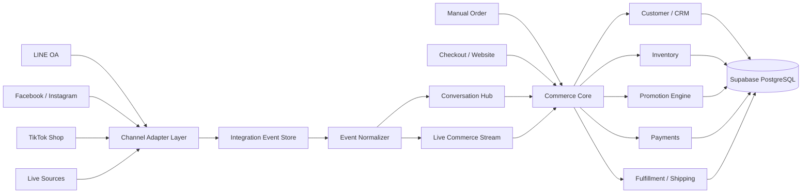
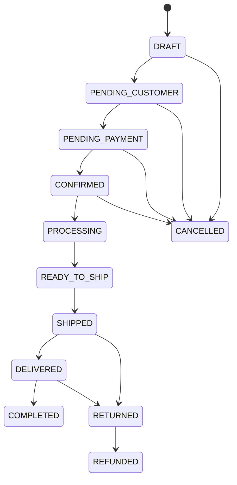

# PROJECT BLUEPRINT

## Conversational Commerce Platform for Thai Social Commerce

**Version:** 1.0 Draft  
**Status:** Architecture / Product Foundation  
**Primary stack:** Next.js + TypeScript + Tailwind CSS + Supabase + PostgreSQL + GitHub + Vercel

---

# 1. Project Vision

สร้าง Web Application สำหรับพ่อค้าแม่ค้าออนไลน์และทีมขายที่ต้องการบริหารการขายผ่าน Social Commerce โดยไม่ต้องพึ่ง Marketplace เป็นศูนย์กลางเพียงอย่างเดียว

ระบบต้องรวมงานสำคัญไว้ในที่เดียว:

- รับและรวมบทสนทนาจากหลายช่องทาง
- เชื่อมข้อความ/คอมเมนต์เข้ากับลูกค้า
- ตรวจจับรหัสสินค้าและจำนวนจากข้อความ
- สร้าง Cart / Draft Order จากบทสนทนา
- คำนวณราคา โปรโมชั่น และค่าจัดส่ง
- จัดการสินค้า SKU และสต๊อก
- ให้ลูกค้ากรอกข้อมูล Checkout ผ่านลิงก์
- จัดการชำระเงิน
- สร้าง Shipment และพิมพ์ใบจัดส่ง
- เก็บประวัติลูกค้าและ CRM
- วิเคราะห์ยอดขาย แชท ทีมขาย และ Live Session

แนวคิดหลักของระบบคือ:

> **Message → Customer → Cart → Order → Payment → Fulfillment → CRM**

ระบบจะถูกออกแบบเป็น **Conversational Commerce Platform** ไม่ใช่เพียง Order Management หรือ Social Inbox

---

# 2. Problems to Solve

## 2.1 Business Problems

ร้านค้า Social Commerce ในประเทศไทยมีต้นทุนจาก Marketplace เพิ่มขึ้น เช่น:

- Platform fee / GP
- ค่าโฆษณา
- ค่าธรรมเนียมบริการอื่น
- การแข่งขันด้านราคา
- ความเสี่ยงจากการพึ่งแพลตฟอร์มเดียว

ร้านค้าจำนวนมากจึงพยายามย้ายการปิดการขายไปยังช่องทางที่ควบคุมเอง เช่น:

- LINE OA
- Facebook Messenger
- Facebook Live
- Instagram
- Direct checkout link

แต่ปัญหาที่เกิดตามมาคือข้อมูลกระจัดกระจายและพนักงานต้องทำงานซ้ำ

## 2.2 Operational Problems

- แชทลูกค้ากระจายหลายแพลตฟอร์ม
- พนักงานตอบแชทชนกัน
- ลูกค้าหลุดจากการติดตาม
- คัดลอกชื่อ ที่อยู่ และเบอร์โทรผิด
- ทำบิลด้วยมือ
- ตรวจสต๊อกด้วยมือ
- โปรโมชั่นคำนวณผิด
- CF สินค้าเกินจำนวนที่มี
- ไม่รู้ว่าลูกค้าเดิมหรือใหม่
- ไม่มี Customer History กลาง
- ติดตาม Order และ Shipment ยาก
- วิเคราะห์ประสิทธิภาพ Live / ทีมขายไม่ได้

---

# 3. Product Positioning

ระบบจะไม่วางตัวเป็น Marketplace ใหม่

ตำแหน่งของผลิตภัณฑ์คือ:

> **Commerce Operating System สำหรับร้านค้าที่ขายผ่าน Chat, Social Media และ Live Commerce**

หลักการคือให้ร้านค้าเป็นเจ้าของ:

- Customer data
- Order workflow
- Inventory
- CRM
- Analytics
- Fulfillment workflow

Platform ภายนอกถูกมองเป็น **Channel / Integration Provider** ไม่ใช่ Core System

---

# 4. Core Product Principles

1. **Multi-Tenant Ready**  
   Business data ทุกชุดต้องผูกกับ `organization_id`

2. **API / Integration First**  
   Integration ภายนอกต้องเข้าผ่าน Adapter Layer

3. **Provider Independent**  
   Core Business Logic ห้ามผูกตรงกับ LINE, Meta, TikTok, Shopee หรือบริษัทขนส่งรายใด

4. **Modular Monolith First**  
   เริ่มด้วยระบบเดียว แต่แบ่ง Domain ชัดเจน ไม่เริ่มด้วย Microservices

5. **Event-Aware Architecture**  
   Webhook ต้องถูกบันทึกก่อนประมวลผลและรองรับ Retry / Idempotency

6. **Database as Source of Truth**  
   PostgreSQL เป็นแหล่งข้อมูลหลัก ไม่ใช้ state ฝั่ง frontend เป็นข้อมูลธุรกิจหลัก

7. **Security by Default**  
   ใช้ Supabase Auth + RLS + Role/Permission + Audit Log

8. **Mobile First / Responsive**  
   ใช้งานได้บน Desktop, Tablet และ Mobile

9. **Human Confirmed Commerce**  
   AI และ Parser สามารถเสนอรายการสินค้า แต่การตัด Stock / Confirm Order ต้องผ่าน Business Rule ที่ตรวจสอบได้

10. **Audit Everything Important**  
    การเปลี่ยนราคา สต๊อก Order Payment Shipment และ Permission ต้องตรวจสอบย้อนหลังได้

---

# 5. System Context



---

# 6. Core Domains

## 6.1 Identity & Organization

รับผิดชอบ:

- Organization
- User Profile
- Role
- Permission
- Team
- Organization Settings

ระบบต้องรองรับหลายร้านในอนาคต แม้ Release แรกจะมีเพียงร้านเดียว

---

## 6.2 Customer & CRM

รับผิดชอบ:

- Customer Master
- Customer Address
- Customer Identity จากหลาย Channel
- Tags
- Customer Timeline
- CRM Activity
- Customer Metrics
- Segmentation ในระยะถัดไป

### Important Rule

`Conversation Identity` ไม่เท่ากับ `Customer`

ลูกค้าคนเดียวอาจมี:

- LINE User ID
- Facebook User ID
- Instagram User ID
- TikTok Shop User ID
- Phone number
- Email

ระบบต้องรองรับการ Merge Identity อย่างปลอดภัย

---

## 6.3 Product Catalog

รับผิดชอบ:

- Product
- Product Variant
- SKU
- Barcode
- Category
- Price
- Cost
- Product status

### Important Rule

Stock และ Order ต้องอ้างอิง `product_variant_id` ไม่อ้าง Product ระดับแม่โดยตรง

---

## 6.4 Inventory

รับผิดชอบ:

- Warehouse
- Inventory Balance
- Inventory Movement
- Reservation
- Adjustment
- Return
- Damage

### Inventory Model

```text
on_hand
reserved
available = on_hand - reserved
```

Stock ต้องตรวจสอบย้อนหลังได้จาก Movement Ledger

---

## 6.5 Conversation Hub

รับผิดชอบ:

- Unified Inbox
- Conversation
- Message
- Attachment
- Assignment
- Internal Note
- Tags
- Saved Replies
- Conversation Status
- SLA Metrics

### Conversation Status

```text
OPEN
PENDING
WAITING_CUSTOMER
RESOLVED
CLOSED
```

### Message Direction

```text
INBOUND
OUTBOUND
```

### Sender Type

```text
CUSTOMER
AGENT
BOT
SYSTEM
```

---

## 6.6 Channel Integration

Integration ทุกช่องทางต้องผ่าน Adapter

ตัวอย่าง Interface ระดับแนวคิด:

```ts
interface MessagingProvider {
  receiveWebhook(input: unknown): Promise<void>;
  sendMessage(input: SendMessageInput): Promise<SendMessageResult>;
  markAsRead?(conversationId: string): Promise<void>;
  getConversation?(externalId: string): Promise<unknown>;
  getMessages?(externalConversationId: string): Promise<unknown[]>;
  downloadMedia?(externalMediaId: string): Promise<unknown>;
}
```

Provider ต้องประกาศ Capability เช่น:

```ts
{
  receiveMessage: true,
  sendMessage: true,
  media: true,
  liveComments: false,
  readReceipt: true
}
```

Core UI ต้องตรวจ Capability ก่อนแสดง Action

---

# 7. Live Commerce

Live Commerce ต้องถูกแยกจาก Customer Service Chat

องค์ประกอบ:

- Live Session
- Live Message / Comment
- SKU Parser
- Live Cart
- Live Cart Item
- Stock Reservation
- Checkout Link

### Example

```text
Customer message: A01 2

Parser Result:
SKU: A01
Quantity: 2

System Action:
Find Variant → Validate Stock → Suggest Add to Cart
```

ระบบควรรองรับ Rule-based Parser ก่อน AI

### Rule Examples

```text
A01
A01 2
A01x2
A01*2
A01+2
CF A01
CF A01 2
```

AI สามารถเพิ่มภายหลังสำหรับ Natural Language แต่ต้องผ่าน Product Matching และ Commerce Validation ก่อนสร้างผลกระทบจริง

---

# 8. Cart & Order

## 8.1 Cart

Cart สามารถเกิดจาก:

- Unified Inbox
- Live Session
- Admin Manual Order
- Customer Checkout

Cart ต้องรองรับการสะสมสินค้าหลายข้อความ

## 8.2 Order State Machine



### Rule

ห้ามกระจาย Business Logic ของ Status ไปทั่ว UI

Transition ต้องผ่าน Order Service / Domain Logic

---

# 9. Promotion Engine

Promotion ต้องแยกเป็น Domain ของตัวเอง

รองรับในอนาคต:

- Discount percent
- Discount amount
- Buy X Get Y
- Threshold discount
- Quantity discount
- Free shipping
- Product-specific
- Category-specific
- Customer-specific
- Coupon
- Date/time constraint

ไม่ควร hard-code โปรโมชั่นใน Order Component หรือ frontend

---

# 10. Checkout

Checkout Link เป็นหนึ่งใน Core Workflow

ลูกค้าควรสามารถ:

1. ตรวจรายการสินค้า
2. กรอกชื่อ
3. กรอกเบอร์โทร
4. กรอกที่อยู่
5. เลือกวิธีจัดส่ง
6. เลือกวิธีชำระเงิน
7. Confirm Order

ระบบต้องรองรับ Tokenized Public Checkout Link โดยไม่เปิดเผย Primary Key ภายในโดยตรง

---

# 11. Payment

Payment Domain ต้องแยกจาก Order

รองรับ:

- Bank Transfer
- QR Payment
- COD
- Payment Gateway ในอนาคต

สถานะตัวอย่าง:

```text
PENDING
PAID
FAILED
EXPIRED
REFUNDED
PARTIALLY_REFUNDED
```

Order status และ Payment status ต้องเป็นคนละ field

---

# 12. Fulfillment & Shipping

Shipping Provider ต้องใช้ Adapter Pattern

```ts
interface ShippingProvider {
  createShipment(input: CreateShipmentInput): Promise<ShipmentResult>;
  cancelShipment(externalShipmentId: string): Promise<void>;
  getTracking(trackingNo: string): Promise<TrackingResult>;
  getLabel(externalShipmentId: string): Promise<LabelResult>;
}
```

รองรับ:

- Shipment
- Package
- Tracking Number
- Tracking Event
- Shipping Label
- Batch Create Shipment
- Batch Print Label

Print target:

- A4
- Thermal 100 × 150 mm

---

# 13. Integration Events

Webhook ห้ามประมวลผล Business Workflow แบบยาวใน request เดียว

Recommended flow:

```text
Provider Webhook
    ↓
Verify Signature
    ↓
Store Raw Event
    ↓
Return Success
    ↓
Async Processing / Worker
    ↓
Normalize Event
    ↓
Domain Processing
```

`integration_events` ต้องรองรับ:

- provider
- external_event_id
- event_type
- payload
- status
- retry_count
- error_message
- received_at
- processed_at

ต้องมี Unique Constraint สำหรับ External Event ที่ควร Idempotent

---

# 14. Audit Log

Audit Log ต้องเก็บอย่างน้อย:

- actor
- organization
- action
- entity type
- entity id
- before data
- after data
- timestamp

Critical entities:

- Product Price
- Inventory
- Order
- Payment
- Shipment
- Customer Merge
- Role / Permission

---

# 15. Security Architecture

## Authentication

Supabase Auth

## Authorization

ใช้สองระดับ:

1. Application Permission
2. PostgreSQL Row Level Security

### Minimum Roles

```text
OWNER
ADMIN
SALES
CUSTOMER_SERVICE
WAREHOUSE
MARKETING
ACCOUNTING
```

### Minimum RLS Principle

Business table ทุกตารางต้องถูกจำกัดด้วย `organization_id`

Client ต้องไม่สามารถอ่านข้อมูลต่าง Organization ได้ แม้แก้ request เอง

---

# 16. Suggested Application Modules

```text
src/
  app/
  components/
  lib/

  modules/
    auth/
    organizations/
    users/
    permissions/

    customers/
    crm/

    catalog/
    inventory/

    conversations/
    live-commerce/

    carts/
    orders/
    promotions/

    payments/
    fulfillment/
    shipping/

    integrations/
    analytics/
    audit/
```

แต่ละ Module ควรมีอย่างน้อย:

```text
components/
queries/
services/
types/
validators/
```

Domain Logic ที่สำคัญไม่ควรถูกเขียนไว้ใน React Component

---

# 17. Initial UI Areas

## Admin Application

### Dashboard

- Sales today
- Orders today
- New customers
- Pending payment
- Ready to pack
- Ready to ship
- Channel distribution
- Response SLA

### Unified Inbox

Layout:

```text
Conversation List | Chat | Customer / Order Context
```

Actions:

- Assign agent
- Add tag
- Internal note
- Create cart
- Create order
- Send checkout link
- Send payment link
- Send tracking
- Saved reply

### Products

- Product CRUD
- Variant CRUD
- SKU
- Price / Cost
- Stock

### Orders

- Search
- Filter date range
- Filter channel
- Filter status
- Sort
- Bulk operation

### Inventory

- Stock balance
- Reservation
- Movement history
- Adjustment

### Customers

- Profile
- Identities
- Addresses
- Orders
- Conversation timeline
- CRM tags

### Fulfillment

- Pick
- Pack
- Create shipment
- Batch print
- Tracking

---

# 18. Development Roadmap

## Phase 0 — Foundation

Deliverables:

- PROJECT_BLUEPRINT.md
- ER_DIAGRAM_V1.md
- PRD.md
- Architecture Decision Records
- Order State Machine
- Conversation State Machine
- Role / Permission Matrix
- Channel Capability Matrix

## Phase 1 — Commerce Core

- Auth
- Organization
- User / Role
- Customer
- Product
- Variant
- Warehouse
- Inventory
- Cart
- Order
- Basic Promotion

## Phase 2 — Commerce Inbox Core

- Unified Inbox UI
- Conversation
- Messages
- Assignment
- Internal Note
- Tags
- Saved Replies
- Customer Context Panel
- Mock Messaging Provider

## Phase 3 — First Real Messaging Integration

Recommended first target: LINE OA

- Webhook
- Identity mapping
- Receive message
- Send reply
- Media
- Checkout link
- Conversation → Cart

## Phase 4 — Meta Integration

- Facebook / Instagram messaging where approved and supported
- Channel capability handling

## Phase 5 — Checkout / Payment / Fulfillment

- Public checkout
- Address
- Payment
- Stock reservation
- Shipment
- Tracking
- Label

## Phase 6 — Live Commerce

- Live session
- Comment event
- SKU parser
- Live cart
- Reservation
- Checkout

Only use provider capabilities that are officially permitted for production use.

## Phase 7 — TikTok Shop Integration

- Order sync
- Product mapping
- Inventory sync
- Fulfillment sync
- Customer Service Chat where approved

## Phase 8 — Automation / Intelligence

- Intent detection
- SKU detection
- Smart reply
- Auto tagging
- Customer matching suggestions
- CRM segmentation

---

# 19. MVP Boundary

MVP ต้องพิสูจน์ Workflow นี้ให้ได้ก่อน:

```text
Customer Message
    ↓
Unified Inbox
    ↓
Identify Customer
    ↓
Detect / Add SKU
    ↓
Draft Cart
    ↓
Create Checkout Link
    ↓
Customer Confirms Address
    ↓
Order Confirmed
    ↓
Reserve / Deduct Stock
    ↓
Create Shipment
    ↓
Tracking
```

MVP ไม่ควรเริ่มด้วย:

- Full accounting
- AI chatbot เต็มระบบ
- Microservices
- Native mobile app
- Advanced campaign automation
- ทุก Marketplace พร้อมกัน

---

# 20. Non-Negotiable Engineering Rules

1. Business table ต้องมี UUID primary key
2. Business table ที่เป็น tenant data ต้องมี `organization_id`
3. ทุก table ต้องมี `created_at`
4. Mutable business table ควรมี `updated_at`
5. ห้ามใช้ชื่อเป็น foreign key
6. SKU ต้อง unique ภายใน Organization ตามกติกาที่กำหนด
7. External IDs ต้องเก็บแยกจาก Internal IDs
8. Money ใช้ integer minor unit หรือ `numeric` ที่กำหนด precision ชัดเจน ห้ามใช้ floating point
9. Timestamp เก็บเป็น UTC และแสดงผลตาม timezone ของ Organization
10. Soft delete ใช้เฉพาะ Entity ที่ต้องรักษาประวัติ
11. Stock ต้องเปลี่ยนผ่าน Inventory Service
12. Order total ต้องคำนวณฝั่ง Server
13. Promotion result ต้องตรวจฝั่ง Server
14. Payment webhook ต้อง Idempotent
15. Provider webhook ต้อง Idempotent
16. RLS ต้องเปิดกับ Tenant Tables
17. Service Role Key ห้ามส่งไป Browser
18. Integration secret ต้องเก็บใน Secret Management / Environment
19. Customer merge ต้องมี Audit Log
20. Schema migration ต้องอยู่ใน Git

---

# 21. Key Architecture Decisions

## ADR-001: Modular Monolith

**Decision:** ใช้ Modular Monolith ใน Release แรก

**Reason:** ลด deployment complexity แต่ยังคง Domain Boundary ชัดเจน

## ADR-002: PostgreSQL as Source of Truth

**Decision:** Supabase PostgreSQL เป็น Canonical Store

**Reason:** Transactional integrity, relational model, RLS, auditability

## ADR-003: Channel Adapter Pattern

**Decision:** ทุก Messaging / Marketplace Integration ผ่าน Adapter

**Reason:** ลดการผูกกับ Provider และรองรับ capability ที่แตกต่างกัน

## ADR-004: Variant-Level Inventory

**Decision:** Stock ผูกกับ Product Variant

**Reason:** รองรับ Size / Color / SKU จริง

## ADR-005: Inventory Ledger

**Decision:** Stock change ต้องมี Movement Record

**Reason:** Audit และ reconciliation

## ADR-006: Payment Status Separate From Order Status

**Decision:** ไม่รวม Payment state กับ Order state

**Reason:** รองรับ COD, partial refund, failed payment และ asynchronous gateway

## ADR-007: Raw Integration Event Store

**Decision:** เก็บ provider payload ก่อน normalize

**Reason:** Debug, retry, reconciliation, provider API changes

---

# 22. Open Questions for Next Design Round

ประเด็นเหล่านี้ยังไม่ควร hard-code จนกว่าจะตกลง Business Rule:

1. 1 Organization มีหลายสาขาหรือไม่
2. 1 Organization มีหลาย Warehouse ตั้งแต่ MVP หรือไม่
3. SKU unique ระดับ Organization หรือ Global
4. Cart reservation timeout กี่นาที
5. COD ต้อง Reserve stock เมื่อใด
6. Payment confirmation แบบ manual ต้องมี Approver หรือไม่
7. Customer merge อนุญาตให้ Auto Merge จากเบอร์โทรหรือไม่
8. Promotion stacking อนุญาตหรือไม่
9. ราคาต่างกันตาม Channel หรือไม่
10. ต้องรองรับ Wholesale / Tier price หรือไม่
11. ต้องรองรับ Tax Invoice / VAT ตั้งแต่ Phase ใด
12. Shipping fee คำนวณตาม weight, zone หรือ rule แบบใด
13. ต้องรองรับ Return / Exchange เต็มรูปแบบใน MVP หรือ Phase ถัดไป
14. Conversation retention policy กี่วัน/เดือน/ปี
15. Live Cart timeout และ stock reservation policy

---

# 23. Definition of a Stable Foundation

ก่อนเริ่มเขียน Feature จำนวนมาก ระบบควรผ่านเงื่อนไขต่อไปนี้:

- ER Diagram ผ่านการ review
- Multi-tenant rule ชัดเจน
- Order state transition ชัดเจน
- Inventory movement rule ชัดเจน
- Customer identity strategy ชัดเจน
- Conversation status ชัดเจน
- Integration event strategy ชัดเจน
- Role / permission matrix ชัดเจน
- Migration workflow พร้อม
- Development / Staging / Production แยก Environment

เมื่อ Foundation เหล่านี้ชัด การเพิ่ม LINE, Meta, TikTok Shop, Shipping Provider หรือ Marketplace ในภายหลังจะไม่ทำให้ Core System ต้องถูกเขียนใหม่ทั้งหมด

---

# 24. Next Documents

เอกสารที่ควรทำต่อจาก Blueprint นี้:

1. `ER_DIAGRAM_V1.md`
2. `PRD_V1.md`
3. `ORDER_STATE_MACHINE.md`
4. `CONVERSATION_STATE_MACHINE.md`
5. `ROLE_PERMISSION_MATRIX.md`
6. `CHANNEL_CAPABILITY_MATRIX.md`
7. `API_CONTRACT_V1.md`
8. `SUPABASE_RLS_PLAN.md`
9. `MVP_BACKLOG.md`


---

# Design Governance Documents

Business logic and database decisions are maintained separately to keep this blueprint stable:

- `BUSINESS_RULES.md` — detailed business rules and decision status
- `ER_DIAGRAM_V1.md` / future `ER_DIAGRAM_V1.1.md` — data model evolution
- `CHANGELOG.md` — design decision history

Business Rule Review Round 2 establishes the Commerce Core rules for stock reservation/allocation, overselling protection, order edits, payment/COD, cancellation, returns, exchanges, RTO, and split fulfillment. These rules are currently `PROPOSED` until explicitly approved.

## Design Update — Configurable Payment Deadlines & Order Consolidation

### Configurable deadline
The commerce core must support payment/reservation deadlines as configurable policies rather than a single hard-coded timeout. Supported modes: duration-based, fixed clock/date-time, and live-session-end based. A cart/order may override the organization/channel default using `payment_due_at`.

### Post-payment additional purchase
A paid order is an immutable commercial record and must not be silently merged/deleted when the customer buys more. New purchases create a new cart/order, then eligible orders may be placed into an Order Consolidation Group for combined customer summary, shipping recalculation, fulfillment, packing, and shipment. Original orders and payment transactions remain traceable.

### Consolidation eligibility
Default eligibility requires same verified customer, compatible shipping destination, unshipped fulfillment, compatible warehouse/provider state, and successful stock validation. Consolidation after shipment is prohibited.


---

## Paid Order Hold, Customer Credit & Loyalty

### Paid Order Hold / Deferred Fulfillment
ระบบรองรับกรณีลูกค้าชำระแล้วแต่ฝากสินค้าไว้กับร้านก่อน โดย Payment = PAID และ Fulfillment = ON_HOLD
Stock ต้องยัง Allocated ให้ Order และห้ามกลับไป Available

Use cases:
- รอซื้อเพิ่ม
- รอรวมหลายบิล
- กำหนดวันส่งภายหลัง
- ลูกค้าขอฝากสินค้าไว้

Held Order สามารถเข้า Order Consolidation กับ Order ใหม่ได้หากยังไม่จัดส่ง

### Customer Credit Wallet
Store Credit เป็นมูลค่าเงินจริงที่ลูกค้านำไปหักยอดซื้อได้ ต้องใช้ Append-only Ledger และแยกจาก Loyalty Point

Sources:
- ค่าส่งจ่ายเกิน
- Refund to credit
- Customer service compensation
- Promotional credit

### Loyalty & Purchase Accumulation
รองรับ Loyalty Program จาก:
- ยอดซื้อ
- จำนวนชิ้น
- จำนวน Order
- ความถี่การซื้อ
- Product / Category / Channel / Live Session
- Campaign / ช่วงเวลา

รองรับ:
- Points
- Tier
- Rewards
- Coupon trigger
- Customer segmentation

Returns/Cancellations ต้อง Reverse points/rewards ผ่าน Ledger

### Customer 360 additions
- Store Credit
- Loyalty Points
- Tier
- Lifetime Spend
- Lifetime Units
- Completed Orders
- Last Purchase
- Held Orders
- Eligible Rewards

---

## Scheduled Hold & Notification Engine

Paid Order Hold ที่กำหนดวัน/เวลาต้องรองรับการแจ้งเตือนผู้ดูแลก่อนเริ่ม Fulfillment

Flow:
`PAID → ON_HOLD → DUE → READY_FOR_REVIEW → ADMIN ACTION → RELEASE / EXTEND / CONSOLIDATE`

ระบบไม่ควรจัดส่งอัตโนมัติเมื่อถึงเวลา เนื่องจากอาจต้อง:
- รวม Order เพิ่ม
- ตรวจที่อยู่
- ติดต่อผู้ซื้อ
- ตรวจ Shipping/Label เดิม
- เลื่อนวันส่ง

Notification Engine เป็นระบบกลางสำหรับ:
- Hold due
- Payment deadline
- Reservation expiry
- COD settlement
- Return inspection
- Shipment exception
- Conversation SLA

Future:
รองรับ Sync ไป Google Calendar ได้ แต่ Calendar ไม่ใช่ Source of Truth
